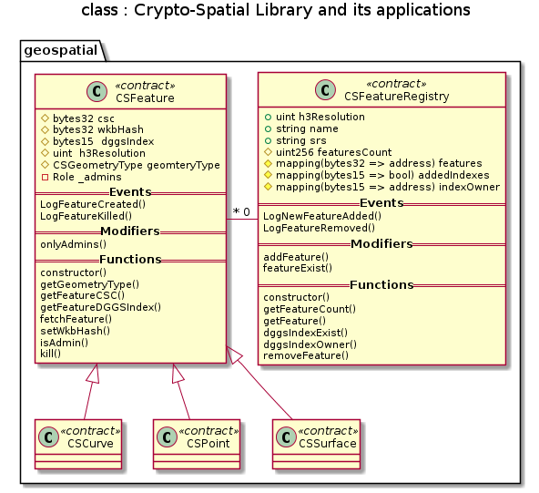

# Desgin pattern decisions

In this document we explain the design patterns applied in the developpment of the solidity smart contracts of this project.

## Table of contents

<!--ts-->
* [Fail early and fail loud](#fail-early-and-fail-loud)
* [Restricting Access](#restricting-access)
* [Mortal](#mortal)
* [Auto Deprecation](#auto-deprecation)
* [Circuit Breaker](#circuit-breaker)
* [Inheritance and interfaces](#inheritance-and-interfaces)
* [Pull over Push Payments](#pull-over-push-payments)
* [State Machine](#state-machine)
* [Speed Bump](#speed-bump)
* [Other design patterns](#other-design-patterns)
<!--te-->

## Fail early and fail loud

In the smart contracts of this project we check the condition required for execution (by using  ```require()```) as early as possible in the function body and throws an exception if the condition is not met . Those exeptions are also confirmed by the tests. Examples :

- [CSFeature.sol](../solidity/contracts/geospatial/CSFeature.sol)

- [CSFeatureRegistry.sol](../solidity/contracts/geospatial/CSFeatureRegistry.sol)

## Restricting Access

The acces to the smart contract functions that change the states is restricted using the openZeppelin library. In fact :

- [CSFeature.sol](../solidity/contracts/geospatial/CSFeature.sol) inherit from ```Ownable``` and use ```Roles``` to limit acces to setters and the ```kill``` function.

- In [CSFeatureRegistry.sol](../solidity/contracts/geospatial/CSFeatureRegistry.sol) access to ```removeFeature``` function is also limited to admins declared in the constructor.

In addition, the acces to the state variable of the [CSFeature.sol](../solidity/contracts/geospatial/CSFeature.sol) smart contract is restricted to ```internal```.

## Mortal

The [CSFeature.sol](../solidity/contracts/geospatial/CSFeature.sol) allow autodestruction which remove it definitly from the blockchain using the  ```removeFeature``` function.

## Auto Deprecation

The auto deprecation design pattern is not used. We prefere using ```Pausable```.

## Circuit Breaker

The [CSFeatureRegistry.sol](../solidity/contracts/geospatial/CSFeatureRegistry.sol) inherit from the openZeppelin ```Pausable``` contract which allow pausing the smart contract from adding and removing features from the registry.  

## Inheritance and interfaces

The geospatial library part of this project, illustrated in the following class diagram, is designed and implemented using inheritance and interfaces to simplify its resusability.



## Pull over Push Payments

This design pattern is not implemented because our smart contracts don't handle the transfer of value between actors for now.

## State Machine

In this release of this project, state machine design pattern is not implemented.

## Speed Bump

The Speed bumps (slowing down actions so that if malicious actions occur, there is time to recover) is not implemented in this release.

## Other design patterns

In this projet we are using the blockchain technology as a data layer for geospatial features by using the [FOAM protocol](https://foam.space/publicAssets/FOAM_Whitepaper.pdf).
